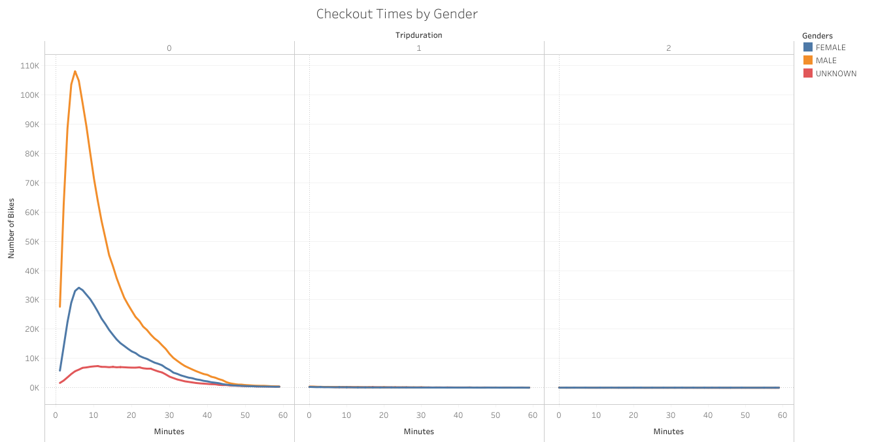

# Bikesharing

## Overview of the Analysis 
In this analysis we used Tableau to create various visualizations based on CitiBike bike-sharing data. The visualizations are used to understand trends and CitiBike business in New York. From there, a solid business proposal can be created towards implementing a bike-sharing program in Des Moines. 

## Results 

The map above shows that the darker and larger purple circles have a higher volume of Citibike riders starting their trip. Some locations such as 12th Ave (NW corner), Pershing Square (NE), West St. (SW corner), and E 17 St. are hotspots for starting CitiBike rides. These areas may have more tourists or a higher population. 

----

The pie chart above shows that the majority of CitiBike trips were taken by males. Of the total 2,344,224 Citibike trips in August, 65% of rides were taken by males. Female riders took 25% of the trips and unknown gender took 10%. 

----

The heatmap above shows that the majority of users start their rides around 7-9 am and 5-6 pm on weekdays. These are the typical times of when jobs start and end. This could mean that majority of weekday riders utilize Citibike to ride to and from work. On weekends, activity is consistent and high throughout the day between 9am and 7pm. This could mean that majority of weekend riders utilize Citibike for leisure. 

----

The heatmap above shows that both males and females show similar patterns in terms of Citibike start times as in the previous slide.  Since 65% of Citibike trips were taken by males, their count is higher than females and unknown across all start times.

----

The heatmap above shows the comparison of riders based on gender and their usertype: customer or subscriber. Out of all the female Citibike users, more are subsribers rather than customers. The same is true for males. Out of all the unknown gender users, more are customers rather than subscribers. Male subscribers take significantly more bike trips than females and unknown gender subscribers. Of all the male and female subscribers, a higher proportion use Citibike on Thursdays. Of all the unknown gender customers, a higher proprotion use Citibike on Saturdays. 

----

The graph above shows that the majority of citibike trips  are completed in less than 1 hour. 5 minutes is the peak trip duration. These short trip durations suggest that most citibike users are travelling short distances to local areas.  

----

The graph above shows that the majority of bike rides taken by male riders are completed in 5 minutes. Majority of bike rides taken by female riders are completed in 6 minutes. Majority of bike rides taken by unknown gender riders are completed in 11 minutes. Still, most riders of any gender complete their trip within 1 hour. 

## Summary 

The data and visualizations show that in the month of August a whopping 2,344,224 Citibike rides were taken. Some areas such as Pershing Square and 12th Ave. are hotspots for starting rides. These areas may have more tourists or a higher population, therefore requiring more bikes. The visualizations also show that the majority of Citibike trips are short (around 5 minutes), suggesting that most users are travelling short distances to local areas. However, this makes sense because most things and places and nearby when living in the city. During the weekdays, most rides begin around 7 to 9 am, as well as 5 to 6 pm. These are typical hours of when the workday begins and ends. This data suggests that most weekday users are taking trips to and from work. On weekends, activity is high and consistent through the day between 9 am and 7pm. 
[Link to NYC CitiBike Tableau Story](https://public.tableau.com/shared/G9HHDW6Y9?:display_count=n&:origin=viz_share_link)

-we can look at which specific date in August had the highest activity and correlate that to any events of activities that were happening in the city on that day
