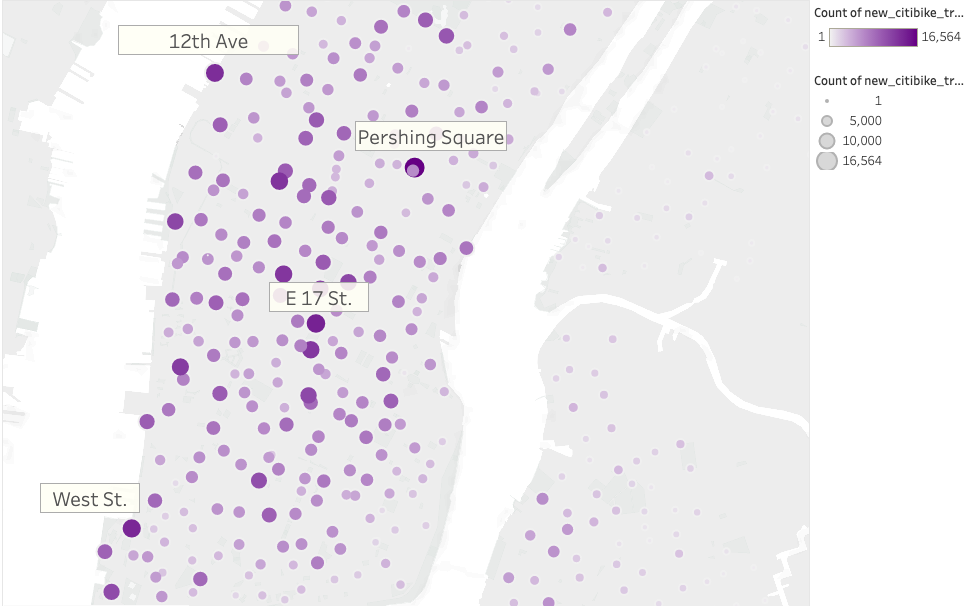

# Bikesharing

## Overview of the Analysis 
In this analysis we used Tableau to create various visualizations based on CitiBike bike-sharing data. The visualizations are used to understand trends and CitiBike business in New York. From there, a solid business proposal can be created towards implementing a bike-sharing program in Des Moines. 

## Results 

## Summary 

[Link to NYC CitiBike Tableau Story](https://public.tableau.com/shared/G9HHDW6Y9?:display_count=n&:origin=viz_share_link)

-we can look at which specific date in August had the highest activity and correlate that to any events of activities that were happening in the city on that day
